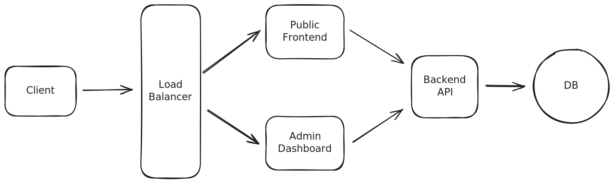

# ntumiwa-site

This is a full-stack web application built primarily with Go's net/http module. The project is currently undergoing a rewrite from the stable version written in Rust.

## Contents

- [High-Level Architecture](#high-level-architecture)
- [Technical Requirements](#technical-requirements)
- [Non-Technical Requirements](#non-technical-requirements)
- [Checklist](#checklist)

## High-Level Architecture

This project uses a Monorepo design. A unified codebase makes it easier for me to manage dependencies and refactor more easily. It also allows me to easily share custom types, configs, and apply build scripts across to the whole repository. Versioning and (hopefully) collaboration will be easier this way.

## Technical Requirements

**Public Site** (`nadiatumiwa.com`)
- Pages: `/`, `/biography`, `/performances`, `/media`, `/contact`, `/mail`, `400`, `500`
- Responsive header with bio snippet
- Upcoming/past performances list
- Media gallery (videos, images, press kit download)
- Mailing list form with spam protection (honeypot)
- Cookie consent popup
- `robots.txt` setup

**Admin Dashboard** (`admin.nadiatumiwa.com`)
- Auth: login page (`/login`) with honeypot, forgot password flow (`/forgot`)
- Pages: `/`, `/users`, `/events`, `/content`, `/contact`, `/mail`
- Manage events, bio content, contact info, and mailing list

**Backend API**
- Public endpoints: fetch events, bio (short/full), media, contact details
- Admin endpoints: full CRUD for events, content, contact
- Route protection, input validation, structured data responses
- PostgreSQL database integration, schema definition and versioned migrations

## Non-Technical Requirements

- Content: short/full bio, events, photos/videos, contact info
- Design: clean, mobile-first UI aligned with personal brand
- Mailing list: opt-in copy, GDPR-safe, anti-spam measures

## Checklist

**Services**
- [x] Plan the rewrite!
- [ ] Public frontend
- [ ] Admin dashboard
- [ ] Backend API

**Database**
- [ ] PostgreSQL configured (connection + credentials)
- [ ] Schema defined with versioned migrations

**CI/CD & DevOps**
- [ ] Plan CI/CD pipeline (likely Jenkins)
- [ ] Automated linting and testing pipeline
- [ ] Build and deployment steps for API and frontend apps
- [ ] Staging and production environments planned
- [ ] Plan secrets/config management
